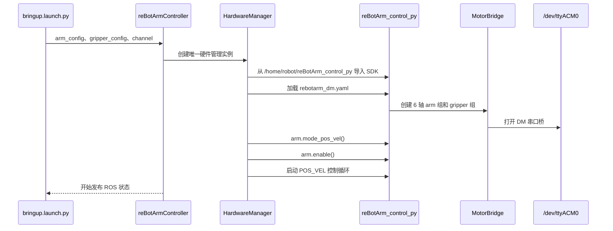
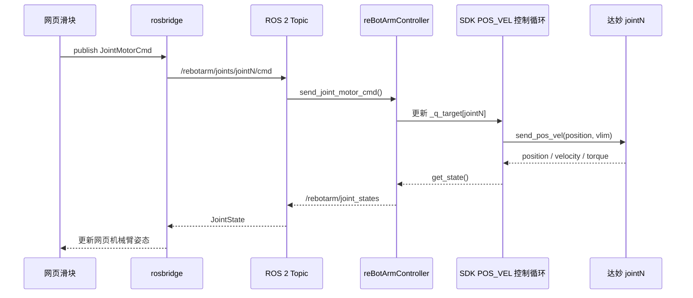
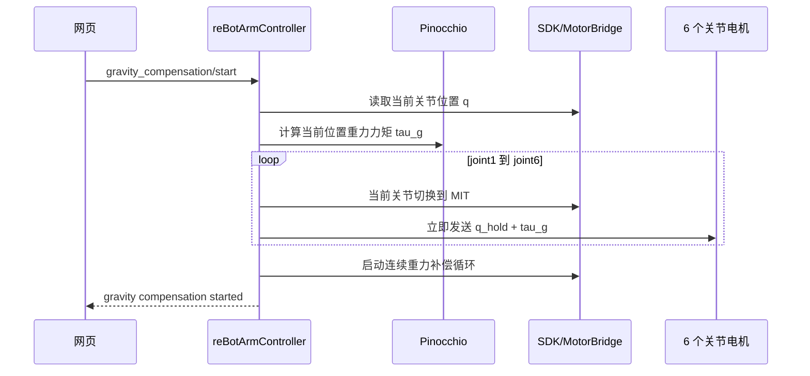
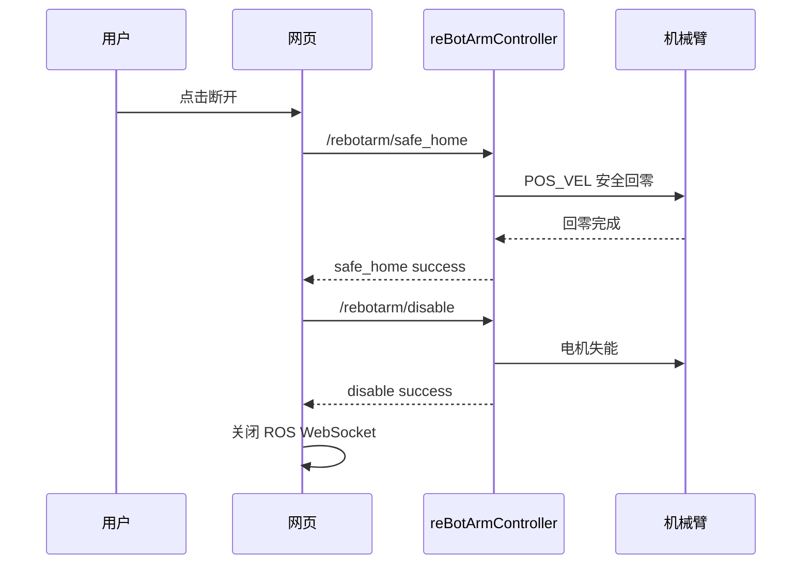
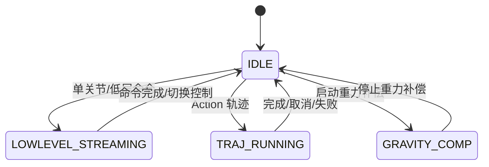

# reBot Arm B601-DM 数据链路说明

本文说明当前 DM 版项目从网页指令到真实电机、再从电机反馈返回网页的完整数据流向。除特别说明外，ROS 2 命名空间均为 `/rebotarm`。

## 1. 当前运行路径

| 层级 | 当前路径或地址 |
| --- | --- |
| 项目根目录 | `/home/robot/ReBot_Arm_DigitalTwin_DM` |
| ROS 2 工作空间 | `/home/robot/ReBot_Arm_DigitalTwin_DM/reBotArm_ros2_DM` |
| 网页控制台 | `/home/robot/ReBot_Arm_DigitalTwin_DM/reBotArm_simulator-DM` |
| Python SDK | `/home/robot/reBotArm_control_py` |
| DM 电机配置 | `/home/robot/reBotArm_control_py/config/rebotarm_dm.yaml` |
| DM 通信设备 | `/dev/ttyACM0` |
| 网页 HTTP 服务 | `http://localhost:3001` |
| rosbridge WebSocket | `ws://<主机 IP>:9090` |

## 2. 总体数据流向

```mermaid
flowchart LR
    U["用户操作"]
    WEB["网页控制台<br/>Three.js + JavaScript<br/>:3001"]
    RB["rosbridge_websocket<br/>JSON / WebSocket<br/>:9090"]
    ROS["ROS 2 Jazzy<br/>Topic / Service / Action"]
    CTRL["reBotArmController<br/>HardwareManager"]
    SDK["reBotArm_control_py<br/>RebotArm / RebotArmEndPose"]
    MB["MotorBridge 0.5<br/>DM Serial Transport"]
    USB["USB-CAN 串口桥<br/>/dev/ttyACM0"]
    MOTOR["达妙电机<br/>joint1～joint6 + gripper"]
    RSP["robot_state_publisher"]
    TF["/tf / /tf_static"]

    U -->|"按钮、滑块、轨迹、夹爪"| WEB
    WEB -->|"rosbridge JSON"| RB
    RB -->|"反序列化"| ROS
    ROS -->|"命令"| CTRL
    CTRL --> SDK
    SDK --> MB
    MB --> USB
    USB -->|"CAN 指令"| MOTOR

    MOTOR -->|"位置、速度、力矩、状态码"| USB
    USB --> MB
    MB --> SDK
    SDK --> CTRL
    CTRL -->|"ROS 状态"| ROS
    ROS --> RB
    RB -->|"WebSocket JSON"| WEB
    WEB -->|"姿态和状态显示"| U

    ROS --> RSP
    RSP --> TF
```



命令方向为：

```text
用户 → 网页 → rosbridge → ROS 2 → reBotArmController
     → reBotArm_control_py → MotorBridge → /dev/ttyACM0 → 达妙电机
```

反馈方向为：

```text
达妙电机 → /dev/ttyACM0 → MotorBridge → reBotArm_control_py
         → reBotArmController → ROS 2 → rosbridge → 网页 → 用户
```

## 3. 启动链路

DM 真机控制器使用以下命令启动：

```bash
cd ~/ReBot_Arm_DigitalTwin_DM/reBotArm_ros2_DM
source scripts/source_rebotarm_env.sh
ros2 launch rebotarm_bringup bringup.launch.py channel:=/dev/ttyACM0
```

启动时的数据流为：



## 4. 关节位置命令链路

网页单关节滑块最终发布：

| 项目 | 内容 |
| --- | --- |
| Topic | `/rebotarm/joints/jointN/cmd` |
| 类型 | `rebotarm_msgs/msg/JointMotorCmd` |
| 位置单位 | rad |
| 速度上限单位 | rad/s |
| 真机控制模式 | POS_VEL |



更新 SDK 的 `_q_target` 很重要，否则 500 Hz POS_VEL 控制循环会用旧目标覆盖单关节命令。

## 5. 轨迹和位姿命令链路

| 功能 | ROS 接口 | 类型 |
| --- | --- | --- |
| 关节轨迹 | `/rebotarm/follow_joint_trajectory` | `control_msgs/action/FollowJointTrajectory` |
| 末端位姿运动 | `/rebotarm/move_to_pose` | `rebotarm_msgs/action/MoveToPose` |
| IK 服务 | `/rebotarm/move_to_pose_ik` | `rebotarm_msgs/srv/MoveToPoseIK` |

网页通过 `/rosapi/action_servers` 检测 Action Server。真机控制器提供标准轨迹 Action，因此不应被识别为 Fake Driver 或降级成网页低层回放。

```text
网页轨迹点
  → rosbridge Action JSON
  → FollowJointTrajectory Action Server
  → HardwareManager.ensure_pos_vel_control()
  → SDK 轨迹/目标控制
  → arm.send_pos_vel()
  → 达妙电机
```

## 6. 夹爪链路

网页使用米作为夹爪开度单位：

| 状态 | 网页/ROS 命令 | 电机角度 |
| --- | ---: | ---: |
| 完全闭合 | `0.00 m` | `0 rad` |
| 完全打开 | `0.09 m` | 约 `-5 rad` |

主要接口：

| 接口 | 类型 | 方向 |
| --- | --- | --- |
| `/rebotarm/gripper/set` | `rebotarm_msgs/srv/SetGripper` | 网页/ROS → 控制器 |
| `/rebotarm/gripper/cmd` | `rebotarm_msgs/msg/JointMotorCmd` | 网页/ROS → 控制器 |
| `/rebotarm/gripper/state` | `rebotarm_msgs/msg/JointMotorState` | 控制器 → 网页/ROS |

```text
网页夹爪开/闭按钮
  → 米制开度 0～0.09 m
  → ROS 夹爪命令
  → HardwareManager.set_gripper_position()
  → 米转换为电机弧度
  → gripper.send_pos_vel()
  → 达妙 4310 夹爪电机
```

夹爪按钮不弹出二次确认，但仍受网页“允许控制”控制锁保护。

## 7. 重力补偿链路

### 7.1 启动

| 接口 | 类型 |
| --- | --- |
| `/rebotarm/gravity_compensation/start` | `std_srvs/srv/Trigger` |



每个关节切入 MIT 后必须立即收到当前位置保持命令，不能等 6 个关节全部切换完成，否则中间窗口可能使用默认零目标，使机械臂向零位运动或下落。

补偿循环的核心输出为：

```text
tau_cmd = tau_gravity(q) + position_hold + damping + integral_correction
```

重力补偿已经运行时再次调用 start 会被忽略，不停止循环、不切换模式、不重新上电。

### 7.2 停止

| 接口 | 类型 |
| --- | --- |
| `/rebotarm/gravity_compensation/stop` | `std_srvs/srv/Trigger` |

```text
停止 MIT 重力补偿循环
  → 保存最后反馈位置
  → 切回 POS_VEL
  → 以最后位置启动位置保持循环
  → 状态机返回 IDLE
```

连接 ROS 时网页不会自动查询或启动重力补偿。用户点击“查询状态”可主动查询；控制器进入重力补偿后，网页会每 500 ms 静默刷新锁定目标角度，停止重补或断开后停止刷新：

```text
/rebotarm/gravity_compensation/status
```

## 8. 安全断开链路

网页“断开时自动安全回零并失能”默认不勾选。

未勾选时：

```text
点击断开 → 关闭 WebSocket
```

勾选后：



若安全回零或失能失败，网页保持 ROS 连接，不会提前断开控制通道。

## 9. 状态反馈链路

`reBotArmController` 默认以 100 Hz 读取和发布真机反馈：

| Topic | 类型 | 内容 | 单位 |
| --- | --- | --- | --- |
| `/rebotarm/joint_states` | `sensor_msgs/msg/JointState` | 6 轴位置、速度、力矩及网页夹爪关节 | rad、rad/s、N·m |
| `/rebotarm/joints/jointN/state` | `rebotarm_msgs/msg/JointMotorState` | 单电机位置、速度、力矩、状态码 | rad、rad/s、N·m |
| `/rebotarm/gripper/state` | `rebotarm_msgs/msg/JointMotorState` | 夹爪开度、速度、力矩、状态码 | m、m/s、N·m |
| `/rebotarm/arm_status` | `rebotarm_msgs/msg/ArmStatus` | 模式、使能、控制循环、状态机、错误码 | 状态值 |

```text
电机反馈
  → MotorBridge poll/request feedback
  → SDK get_state()
  → JointStatePublisher
  → ROS 2 Topic
  → rosbridge WebSocket
  → 网页状态面板和 Three.js 模型
```

`robot_state_publisher` 同时订阅 `/rebotarm/joint_states`，结合 URDF 发布 `/tf` 和 `/tf_static`。

## 10. 服务和状态机总览

主要控制服务：

| Service | 作用 |
| --- | --- |
| `/rebotarm/enable` | 机械臂使能 |
| `/rebotarm/disable` | 停止控制并失能 |
| `/rebotarm/safe_home` | 切回 POS_VEL 并安全回零 |
| `/rebotarm/gripper/set` | 设置夹爪开度 |
| `/rebotarm/gravity_compensation/start` | 启动 MIT 重力补偿 |
| `/rebotarm/gravity_compensation/stop` | 停止重补并返回 POS_VEL 保持 |
| `/rebotarm/gravity_compensation/status` | 手动查询重补状态 |

控制器状态机：



## 11. 真机与仿真链路边界

真机验证时应只运行一个 `/rebotarm` 控制器：

```text
reBotArmController + /dev/ttyACM0
```

不要同时运行旧 RS 控制器或使用同一命名空间的 Fake Driver，否则网页可能收到错误来源的状态和服务。

| 模式 | 执行端 | 是否连接真实电机 |
| --- | --- | ---: |
| DM 真机 | `reBotArmController` | 是，`/dev/ttyACM0` |
| Fake Driver | `FakeReBotArmDriver` | 否 |
| MuJoCo | `rebotarm_mujoco` 节点 | 否，物理仿真 |
| Three.js 网页 | 浏览器 | 否，只负责显示和交互 |

## 12. 快速诊断

```bash
# 确认只有一个控制器
ros2 node list

# 确认 DM 串口占用者
fuser -v /dev/ttyACM0

# 查看关节反馈
ros2 topic echo /rebotarm/joint_states --once

# 查看状态
ros2 topic echo /rebotarm/arm_status --once

# 查看动作接口
ros2 action list -t

# 查看 rosbridge 和网页端口
ss -ltnp | grep -E ':9090|:3001'
```

正常 DM 链路至少应包含：

```text
/reBotArmController
/robot_state_publisher
/rosbridge_websocket
```
